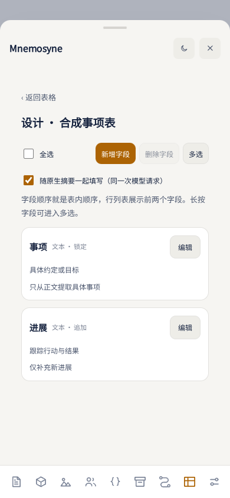
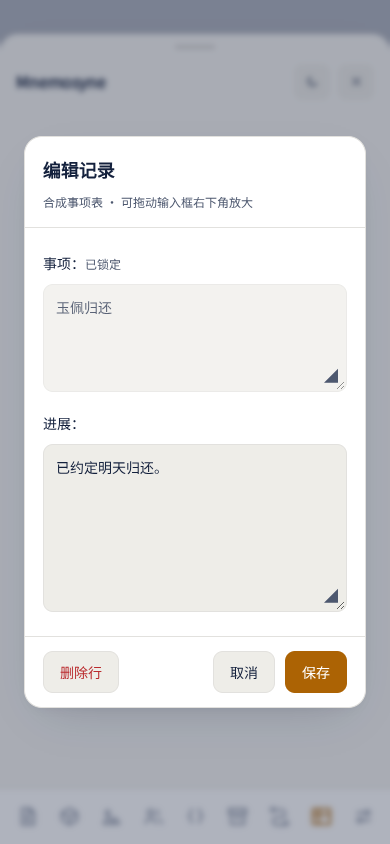

# Mnemosyne 日用记忆使用说明

适用分支：`work/daily-memory-mvp-baibai`，2026-09-24 手动事件链与正文补表修订版。状态仍为 `implemented_unverified`；合成浏览器检查已运行，实际 TT 手机体验待用户确认。

## 先回答“需要点知识库复制吗？”

**只有你曾在旧柏宝书导入知识库，且要继续使用这些文件时才需要点。** 正文和摘要归档不依赖它。没有旧知识库就跳过。

打开原聊天后，看到 **“已归档 · 正文 N · 摘要 M · 待审核 0”**，且没有 pending / 错误，表示这个聊天的正文和已有摘要已经进入独立的 Mnemosyne 正式数据库。不是只显示聊天里的计数。当前聊天会继续自动归档后续变化；不需要再点某个“确认迁移”按钮。

首次打开大聊天，后台归档可能仍需等待；“已归档”后不会为了打开页面而重新读取所有正文和摘要。档案页不再显示全量正文/摘要，自定义表页也不加载摘要选择列表。看摘要请使用原生“摘要”页。

## 档案 / 迁移页

| 按钮或状态 | 用途 | 何时使用 / 是否调用模型 |
| --- | --- | --- |
| 已归档 | 当前聊天已写入新库，显示当前视图计数 | 平时看到即可；待审核数与归档成功是两件事 |
| pending / 可重试 | 当前宿主保存或新库同步未完成 | 阅读错误，解决后点刷新 / 重试；不需要重新导入聊天 |
| 刷新 / 重试归档 | 检查聊天变化，补交失败的归档 | 无变化时复用已完成视图；不调用模型 |
| 从旧柏宝书复制本角色知识库 | 复制当前角色的旧知识库文件和已有向量到新扩展的知识库命名空间 | 可选；不调用模型、不改旧库；同 ID 已复制的文件会跳过。旧索引不完整会提示重新导入 |
| 导出核心包 | 下载整个活动库的逻辑备份，包含全部故事和分支 | 跨设备或备份时使用；先等最新归档完成 |
| 恢复到新空库 | 验证包，写入另一空库，再切换活动库 | 不合并两端修改；失败不替换原活动库，成功也保留原库 |
| 加载待审核项（只读） | 按需读取已归档视图中的待审核摘要 | 不触发归档，不改摘要或事件，不调用模型；等待后台归档完成再读 |
| 查看来源差异 | 显示原来源楼层、首处身份/正文/角色差异及短片段 | 只读、本机对照，不自动确认兼容；高层还需检查下级版本 |
| 保留摘要 | 人工确认该摘要对当前正文版本仍适用 | 不调用模型，只对当前 Head 生效 |
| 重新生成 / 重建本层 | 重新生成 L0 或高层摘要 | 调用摘要模型；高层先处理下级，不自动级联重建 |

如果复制聊天后出现身份提示：独立剧情选“独立新故事”；另开支线，选择来源聊天和继承条数，再点“继承档案”。页面不再提供同分支换聊天续接。

### 切聊天后事件突然不显示怎么办？

事件保存在本机独立 IndexedDB `mnemosyne_daily_*` 中，按正式故事和分支隔离。父分支与子分支即使消息条数、文字完全一样，仍是两个分支，不能根据文字自动合并。事件页跟随当前聊天重新读取，区分正在读取、读取失败、当前分支没有事件和已有记录因来源校验暂不显示。

若突然出现大量待审核，先到“数据包边界与恢复 → 导出核心包”确认下载成功。核心包包含库里所有故事、分支的事件及历史，包括当前页面未显示的记录；不要因此重复建链、恢复旧包或批量重新生成。

等状态为已归档，展开“待审核摘要”，点“加载待审核项（只读）”，再看第一条 L0 的“查看来源差异”。这些读取不更改审核结果、摘要、事件或宿主聊天，也不调用模型；后台归档仍是独立功能。原片段和当前对照片段仅在本机显示，最多100字，带转义符帮助识别换行。这里只显示首处差异，不能据此自动认可全部内容。

旧摘要若没有精确输入记录，会按生成时的历史前缀检查。一处早期正文、角色分类或消息身份变化，可能使许多后续摘要同时待审核，依赖这些来源的事件也暂时不显示。事件记录仍可在核心包中保留。“保留摘要”是人工确认该摘要仍适用，不等于修复事件的历史校验；不要把逐条点保留当作通用恢复办法。若需要反馈，可只提供事件页的已保存数量、来源差异类型与楼层，正文片段可遮盖，无需上传整个私人核心包。

### “进入新数据库”包含哪些内容？

- 正式档案库 `mnemosyne_daily_*`：正文/摘要及版本、故事分支、事件、回执、自定义表、宿主映射。
- 知识库和向量：另有独立的 Mnemosyne 本地库；复制知识库不等于把它装进核心档案包。
- 人物、物品、地点、生活档案等原有状态仍在聊天 delta 中，继续由原界面重放。

**核心包不是完整 TT 或柏宝书备份。** 它不包含宿主聊天文件、聊天 delta、知识库文件/向量、索引和 API 密钥。换设备时另外迁移宿主聊天、知识库原文件并配置模型。向量重建可能产生 Embedding 费用。

新版导出 `mnemosyne-daily-v4.json`，包含事件归档标记，支持恢复旧 v1 / v2 / v3 包。物理 IndexedDB 仍为版本 1，不升级 object store、不删旧库。旧版扩展不能理解新的归档标记及其他新增字段，回退时保留新版包，使用更新前的备份恢复旧版。

## 手动事件链：你归组，AI 写概要

在聊天内每条有效 AI 摘要卡片右侧点事件图标，出现两行菜单：

1. **新建事件链**：输入整体事项说明，例如“把这一天的早餐、做花灯、逛街和灯会作为一次完整约会”。点击新建后还有一次 API 确认。程序发送原生单楼摘要使用的角色卡、用户设定、世界书、此前状态/摘要等材料，加本楼正文、摘要和你的说明，仅调用一次摘要 API，生成待审阅的链名、初始概要和关键词。返回后打开可编辑的确认窗口，点“确认写入”才创建事件链并关联本楼；不重写本楼摘要或人物/物品。
2. **加入已有链**：选链并确认，再选“立即更新”或“仅入库”。后者不调用模型。前者发送该链全部有效成员及本楼材料，返回后先审阅；点“确认写入”才一起保存本次新增关联、当前概要和追加进展。已有本楼不会重复关联；取消不会新增本楼关联，之前保存的关联仍保留。全部成员已更新时不再花费一次请求。

可连续多楼选择“仅入库”，等事件收束再更新一次。新建的边界说明进入本次初始标题/概要；后续按这条链的标题、概要及全部成员继续整理，模型不再有拆链或新建链权限。番外、没有摘要或摘要待审核的楼需先处理后再入链。

楼层事件操作的成功、失败、请求超限等结果以弹窗提示，点击“确定”关闭；卡片按钮下不留提示文字。发送失败时保留输入，可关闭提示后重试；网络或 API 报错仍作为请求失败提示。收到返回正文后，即使格式错误或正文为空，也先打开“审阅事件返回”，不会直接写入。

新生成或手动编辑的事件概要不超过 **500字（含标点、数字、字母，去掉首尾空白后计数）**。AI 只保留事件核心变化、关键决定与结果，以及对关系或重要转变有实质影响的细节，舍弃琐碎流水账。超长模型结果不能直接写入；楼层审阅窗口可手动精简后确认，不截断保存、不自动增加一次 API 调用，也不推进尚未保存的整理范围。编辑弹窗显示字数，超过上限不能保存。旧概要不会自动改写；可手动精简，或有新成员待处理时通过下次更新生成短概要。

**审阅和修正 AI 返回**：

- 上方提示区区分空正文、JSON 语法错误、重复字段、字段缺失/类型错误和概要超长。可提供时显示行列；“疑似截断”仅根据正文判断，不能证明一定触及输出上限。
- “待保存 JSON”可直接编辑，下面“填写格式说明”有完整示例。五个字段均需保留：`title`、`status`、`keywords`、`overview`、`progress`。状态填写 `open / resolved / dormant`，关键词是文本数组，概要不超过500字。
- 展开“AI 返回正文（原样）”可对照未经你编辑的输出。它是接口提供的正文，不包含独立思考内容、完整 HTTP 响应或结束原因。
- 格式通过后才能点“确认写入”，确认时还会再次校验来源/聊天/事件是否改变。标题、状态、关键词和概要使用修正后的值；`progress` 只为未整理成员追加进展，重写已整理内容不新增历史进展；修正和确认不再次调用模型，连续点击不会重复建链。
- “取消”放弃本次草稿，不写事件或本次关联。窗口期间不要切聊天或刷新；草稿仅临时保留，不进入备份。若保存时来源已改变，复制所需草稿后取消并重新打开。
- 该确认流程用于楼层的新建、“立即更新”和事件菜单的“重写概要”。事件页批量/自动整理维持现有自动校验、合法结果保存的流程，不逐条弹确认窗口。

**自定义概括方式**：进入“设置 → 自定义提示词 → 事件概要提示词”。与摘要、二次总结使用同一编辑弹窗，默认预填现用规则，可直接修改重点、取舍和写法；点击“完成”才保存，“取消”放弃草稿。“恢复默认”后再点“完成”恢复内置规则，留空也使用默认。保存后从下一次新建事件、立即更新、重写概要、批量整理或自动更新请求生效；不会自动重写已保存概要。

此设置与摘要/二次总结提示词分别保存，全聊天共用，随现有宿主扩展设置保存；不在 Mnemosyne 档案核心数据包内。角色、本楼正文和链内材料仍由程序附带，无需在这里写材料宏。你可以自定义概括方式，500字限制、人工选定的事件边界及 JSON 输出约定继续由程序保留。

事件页：

- **新建事件**：手工建立空链，无 API 调用；之后从楼层卡片加入内容。
- **编辑**：同一弹窗修改标题、状态、当前概要、关键词。当前概要可修订；原进展记录保留。
- **归档**：长按主页中折叠的事件卡片，在弹窗点“归档”；桌面可右键，也可聚焦卡片后按 Shift+F10。归档只把卡片从主页收起，不改变状态或召回资格，不调用 API。
- **重写概要**：长按折叠卡片（归档页也可），在“归档／取消归档”下点“重写概要”。输入希望突出、删减或改变的写法，点“重写”并确认一次 API 调用；模型结合该链全部有效成员正文、摘要、当前概要和你的要求重新概括。随后进入同一个可编辑返回窗口，确认才保存。即使没有新成员也可重写；不会新建事件或解除归档，旧概要版本和历史进展保留。无有效成员时需先从楼层加入内容。
- **归档事件**：入口在“新建事件”右侧。归档列表折叠时只显示标题；点开后可看概要、完整追加史并编辑/删除。长按折叠标题选择“取消归档”移回主页。归档链仍可加入新摘要、更新概要和参与召回，归档标记随核心包备份恢复。
- **删除**：再次确认后完整删除该事件链、关联、概要版本、进展及相关旧处理回执。正文、摘要和其他链保留，不能撤销；需要留存时先导出。
- **批量整理 / 停止**：仅更新已有链的待处理成员，一条待更新链一次请求。停止后不提交尚未返回的结果，已保存的链保留；关闭页面不承诺后台运行。
- **自动更新概要和关键词**：按消息楼数间隔检查待更新链，使用摘要渠道，未指定则主 API。旧的延后最近楼数和单次摘要条数设置不再参与任务。已有小链保留，不会自动合并。
- **完整请求预算**：针对整条链材料；超限会暂停，不悄悄截断。较长的链需要相应模型上下文和预算。

折叠卡片显示标题、关键词、状态与关联数；展开显示完整当前概要和“完整追加史”中的成员摘要，不再单独展示“最新进展”。移除关联不删除原摘要，但相关旧概要/进展不再当作完整有效材料使用。

### 召回维持原规则

先完成 Query、向量、BM25、RRF、rerank 和配额，再为命中所属链补上有界进展节选；同链只包装一次、最多额外带一条有效进展，不泄漏截止点之后内容。手动编辑的当前概要暂不替换原召回用的追加进展节选。

| 设置 | 含义 |
| --- | --- |
| 一次召回最多补充几条链 | 最终命中后最多包装的链数，0关闭事件补充 |
| 每链概述节选字符数 | 原有进展节选长度上限 |
| 事件总注入预算 | 本轮所有事件补充的额外总字符上限 |
| 每链额外进展摘要 0 / 1 | 可否补一条最新进展；已命中或在近期全文中不重复 |

事件、摘要/原文和知识库组成同一召回提示块，使用原“混合召回 → 注入深度”位置。事件概要的 API 调用与召回是两个阶段。

## 自定义表：从建表到自动填写

### 建表和设计字段

1. 进入“表格”，点击“新建表”，填写名称、可选说明。“随摘要填写”控制是否允许摘要 AI 自动更新；可关闭后纯手工使用。
2. 主界面只显示表列表。点击表名打开；右键、长按或点击 `···`，选择改名、删除表或设计表。
3. 设计页点击“新增字段”。每次弹窗只编辑一个字段，共五项：字段名、写入策略、类型、字段介绍、给 AI 的填写提示词。
4. 保存后，字段列表显示名称、浅色的小字号类型/策略、字段介绍、填写提示词预览；右侧“编辑”重新打开该字段。
5. “多选”或长按一行进入多选，可删除字段。删字段保留旧值用于归档，但不再把旧值发送给模型。已建字段不能原地换类型，需新建字段。

| 写入策略 | AI 行为 | 人工编辑 |
| --- | --- | --- |
| 覆写 | 用新值替换该单元格 | 可修改 |
| 追加 | 只返回新的文本，程序另起一行追加 | 编辑完整内容；仅文本字段支持追加 |
| 锁定 | 允许首次填入，已有值后不能再改；0 和“否”也算已有值 | 同样锁定；确需改值，先在设计页更改策略 |
| 仅手动（旧字段兼容） | 不允许 AI 写入，包括第一次 | 可修改；不会自动转成“锁定” |

字段介绍说明“这列是什么”，填写提示词说明“从正文找什么、怎样填”。例如：名称“约定内容”；策略“锁定”；类型“文本”；介绍“双方已明确同意的约定”；提示词“只记录正文中已达成的具体约定，不推测未说出口的计划”。

### 查看和编辑行

- 表内容页只预览每行的前两个字段；点击行打开全部字段，逐项编辑，右下角取消 / 保存。
- 文本和数字输入框右下角可拖动放大；“是否”使用中文下拉选项。
- 顶部可新增行、全选本页、多选、隐藏行、显示行。长按一行也能进入多选。
- 隐藏后默认列表不显示；勾选“查看隐藏行”，选择这些行再点“显示行”即可恢复。
- 搜索只查当前表，20 行一页。删除整行在编辑弹窗中，需要确认，旧数据保留在核心包。

### AI 何时填？填表和注入放在哪里？

正常生成最新楼的原生摘要时，在**同一次 LLM 调用**中发送本轮正文、原有状态材料，以及所有启用表的定义、字段介绍、填写提示词和已有可见行。原有摘要 JSON 额外增加 `customTables` 的 `add/update` 增量字段，仍是原摘要渠道，不另开填表 API 请求。

没有变化也必须返回空的 `add/update`；缺字段或格式错误不会算填表成功，会沿用原摘要重试设置。锁定、类型、合法行/字段 ID 和并发变化都由程序校验。聊天先保存摘要及填表操作，再归档并提交表格；失败显示“摘要已保存，填表待处理”，重试不会重复追加。不要把“摘要已保存”当成“填表必然成功”。

表内容用于正文生成时，并入原有 **“当前状态”系统提示**：最新 AI 楼已有有效摘要时深度 D1，尚无摘要时 D2，与时间/地点、人物、物品同一位置；开启“仅摘要模式”时，沿用原规则不注入当前状态。

**隐藏行不发送给摘要 AI，也不进入正文上下文。** 关闭“随摘要填写”只停止自动修改；有效的可见行仍可作为状态注入。已失效来源对应的行不自动作为有效事实发送。

纯历史补摘和高层压缩不修改当前表：当前表没有完整的历史状态重放，不能把未来表状态用于旧楼。包含最新楼的批量补摘，可在该同次请求中返回整批的净变化。不是按事件间隔重新请求一次填表。

### 关闭自动填表后，怎样补齐？

表列表页点“批量补表”，多选表后，每张表显示最后确认楼号 → 当前最新楼号 / 总楼数，可分别填写起止楼号（从0开始）。没有字段的空表先设计字段。最后确认楼号不是“之前每楼全部已处理”的保证，可回头选择缺失范围。

确认后用摘要 API 发送**正文而非摘要**，附该表定义、字段填写提示词和当前可见行。每张表每20楼一个固定批次；成功后原子保存行和实际正文版本回执，明确无变化也记进度。关闭“随摘要填写”的表仍可主动补表，原自动开关不改变。

覆盖已更新范围时，提示词要求只补缺失事实：已有内容不再新建、重复更新或追加；字段类型、锁定、人工字段和合法 ID 仍由程序校验。模型理解相同事实的能力仍会影响语义去重，请实测检查。手动补表是在当前表状态上补缺，不是把整张表恢复到历史楼层。

隐藏行不发送，番外正文用空材料跳过。超预算、失败或停止不推进未成功批次，可按显示的进度继续。正文改动后不再以旧回执冒充当前已处理；依赖旧正文的行仍保留供人工检查，但不发送为当前有效事实。

## 手机更新后的短检查

1. 更新到该分支最新提交，重新加载 TT 扩展；只启用 Mnemosyne。
2. 已归档聊天打开档案页，应直接看到状态/按钮，没有正文与摘要列表。打开表格页，应直接看到表列表。
3. 建两个字段（一个锁定、一个追加），新增一行；尝试长按多选、隐藏/显示、打开行并拉大输入框。
4. 在你愿意使用模型的测试聊天中生成一条新的原生摘要，确认同次请求有填表结果、没有另起填表调用；检查主模型的当前状态注入是否含可见行、排除隐藏行。
5. 导出核心包并恢复到新空库，确认表定义、策略、行内容和隐藏标记仍在。

本轮使用合成资料完成 Node/fake-IDB 与本地 Chromium 检查；未读取你的聊天、未调用真实付费模型、未操作你的 TT 设备。真实手机耗时、后台中断及真实模型填表质量仍需要实测反馈。

## 在 TT 创建聊天分支后怎么选？

打开新分支的档案页，在“来源聊天”下拉菜单选择原会话。菜单只列当前角色 / 群组在本机活动库中已归档的聊天；复制来的绑定仍可定位时，会预选并标记“当前聊天的来源”。名称和消息数来自归档记录，无需查内部 ID；列表不加载正文或摘要。

- **继承档案**：适合 TT 的“创建分支”。例如原聊天有100条消息，在第60条之后另开支线，就继承开头60条；此后两条路线独立发展。原聊天剩余消息不删除、不覆盖。分叉不复制父分支的事件链或自定义表。
- **作为独立新故事**：不继承原分支身份，当前聊天作为独立故事归档。

“继承开头多少条消息”就是原“父分支前缀”的长度。User、Assistant、开场白各算一条，不是对话轮数；宿主若从0编号，最后保留楼号加1才是条数。默认填原档案与当前聊天长度的较小值，仅为建议，不是自动验证结果。已经在新分支聊过新内容时，要改为分叉时保留的条数。确认时仍核对身份和正文；不匹配会停止，不能靠相同文本强行认作同一消息。

找不到来源时，先回原会话等待“已归档”，再打开新分支。若本机没有原档案或消息身份已丢失，不能仅凭聊天名称恢复原身份。页面打开只读列表，选择菜单不会立即续接或分叉，必须点击对应按钮。

## 2026-09-24 界面修订

楼层事件菜单使用顶层浮层，空间不足时向上展开；点击外部、滚动、调整窗口或按 Esc 会关闭。新建、保存、确认发送等主要操作使用强调色；取消、刷新、编辑、分页等辅助操作使用较暗的中性色。成员的“移除关联”为标题行上的小按钮，展开后的完整摘要独占整行宽度，预览最多三行。
